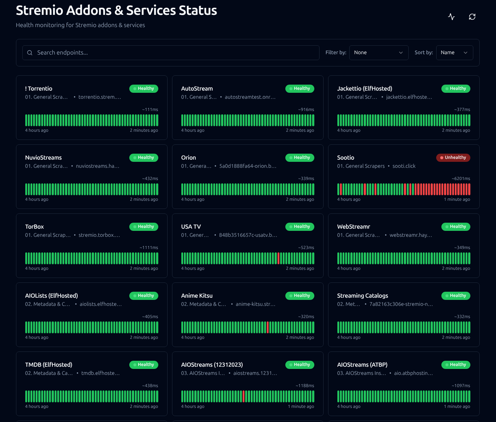
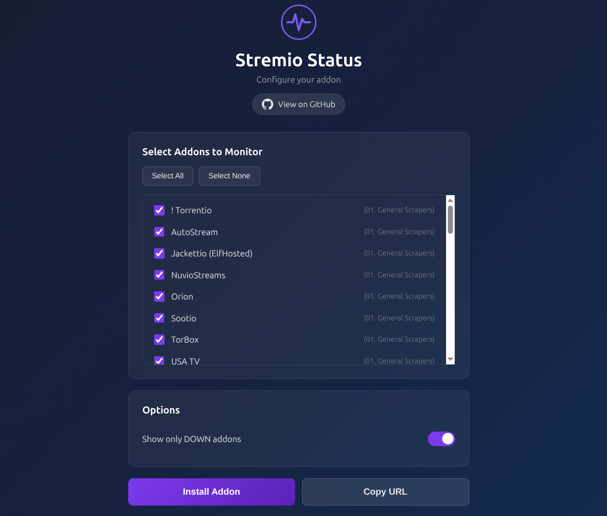
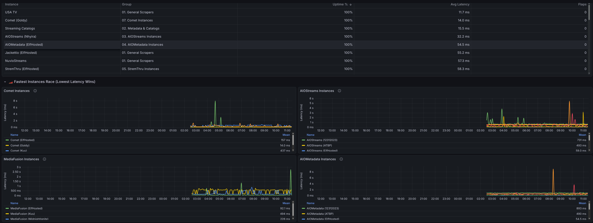

<p align="center">
  
  <h1 align="center">Stremio Status</h1>
  <p align="center">Unified status page, health metrics, and monitoring addon for Stremio services</p>
</p>

---

| Service | Link |
| :--- | :--- |
| **Status Page** | [status.stremio-status.com](https://status.stremio-status.com) |
| **Grafana Analytics** | [stats.stremio-status.com](https://stats.stremio-status.com/d/home-dashboard/community-status-home?kiosk=true&orgId=1&from=now-24h&to=now&timezone=browser&refresh=1m) |
| **Addon Config** | [addon.stremio-status.com](https://addon.stremio-status.com) |

---

<table border="0">
  <tr>
    <td align="center" valign="top">
      
    </td>
    <td align="center" valign="top">
      
    </td>
  </tr>
  <tr>
    <td colspan="2" align="center">
      
    </td>
  </tr>
</table>


## Self-host with Docker
```
git clone https://github.com/SolitudePy/stremio-status.git
cd stremio-status
cp .env.example .env
docker compose up -d
```

### Environment Variables
| Variable | Description | Default | Required |
| :--- | :--- | :--- | :---: |
| `COMPOSE_PROFILES` | Docker Compose default profile | `full` | **No** |
| `DB_PASSWORD` | Password for the PostgreSQL database | `secure_postgres_password_here` | **Yes** |
| `POSTGRES_HOST` | Password for the PostgreSQL database | `postgres` | **Yes** |
| `GRAFANA_PASSWORD` | Admin password for the Grafana dashboard | `admin_password_here` | **Yes** |
| `GF_SERVER_DOMAIN` | The domain used specifically for Grafana | `stats.stremio-status.com` | **Yes** |
| `DOMAIN` | Your public domain (e.g. `status.example.com`) | `stremio-status.com` | No |
| `PROXY_URL` | Optional proxy URL to bypass network blocks | (Empty) | No |
| `WARP_PROXY_URL` | Cloudflare WARP proxy for healthchecks (leave empty to use host IP) | (Empty) | No |
| `DISCORD_WEBHOOK_ENABLED` | Set to `true` to enable Discord notifications | `false` | No |
| `DISCORD_WEBHOOK_URL` | The Discord Webhook URL for alerts | (Empty) | No |
| `ADDON_LOG_LEVEL` | Logging verbosity (`debug`, `info`, `warning`, `error`) | `info` | No |
| `ADDON_HEALTH_BASE_URL` | URL to fetch health data from status-page | `http://gatus:8080` | **Yes** |
| `ADDON_PUBLIC_BASE_URL` | Public URL where this addon is accessible | `http://localhost:7000` | No |
| `ADDON_CACHE_TTL_SECONDS` | How long to cache health data (seconds) | `45` | No |

> Latency Disclaimer: High response times are sometimes due to the proxy routing required for certain addons. This does not necessarily reflect the performance of the addon when used directly (for best results self-host).
